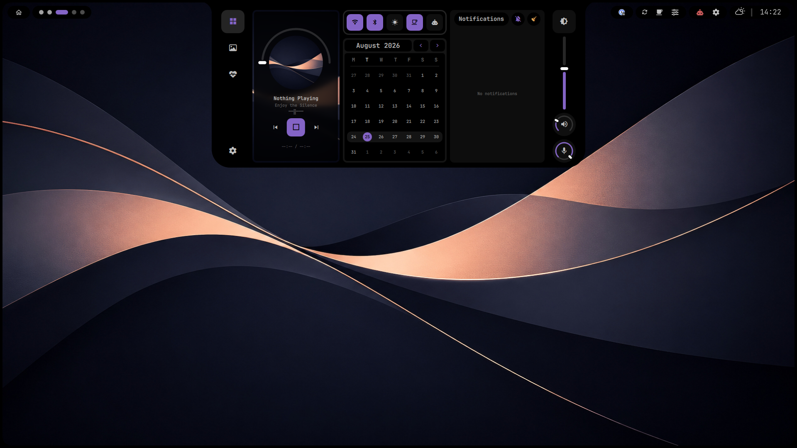

# Ruixen Shell

A connected bar, notch, and settings app for Omarchy — an OLED-black, unified
visual layer that runs as plugins inside the Omarchy shell you already use.



## What's included

- **`ruixen.bar`** — the top bar itself: app launcher, GNOME-style dot
  workspace indicator, pinned quick-launch apps, weather, clock, and a
  settings shortcut, all in one connected pill layout.
- **`ruixen.notch`** — a center-notch dashboard with metrics, wallpapers,
  storage, and music control, expanding from the bar.
- **`ruixen.frame-widget`** — the OLED-black screen frame that ties the bar
  and notch together visually.
- **`ruixen.settings`** — a standalone settings app (Audio, Wi-Fi, Bluetooth,
  Display, Plugins) that can replace the default Omarchy settings panel
  entirely, or run on its own.
- **`ruixen.pinnedapps`** — quick-launch row for apps pinned in the notch's
  own app launcher.
- **`ruixen.pluginpins`** — a pin/unpin dropdown on the bar for any other
  installed bar-widget plugin (yours or a third party's) — install
  something new, pin it from here, no shell.json editing required.
- **Tray widgets** — `ruixen.tray`, `ruixen.stayawake`,
  `ruixen.quickactions`, `ruixen.weather`, `ruixen.applauncher`,
  `ruixen.settingsbutton`. `ruixen.stayawake` (and any stock Omarchy widget
  it sits next to, like the AI usage indicator) is pinned on or off through
  `ruixen.pluginpins` above, not a separate settings toggle.

`ruixen.media` backs `ruixen.notch`'s own music control as a background
service — it never shows a bar icon of its own by design (an earlier,
oversized play/pause badge was retired), so it's locked in Settings' Plugins
list with no toggle.

Every plugin shares the same OLED-black background, corner radii, and motion
language, so they read as one shell instead of a pile of separate widgets.

## Install

Ruixen Shell targets Omarchy `4.0.0-1` (also confirmed working on `4.0.1-1`).
Install from source:

```bash
git clone https://github.com/gitcoder89431/ruixen-shell.git
cd ruixen-shell
./install.sh
```

An AUR package is planned but not yet published — cloning from source is the
only install path right now.

The installer copies each plugin into `~/.config/omarchy/plugins/`, backs up
anything it would overwrite, merges Ruixen's bar/plugin config into your
existing `shell.json` rather than replacing it outright (any unrelated bar
widgets, plugins, or idle settings you already had survive), applies a
matching Hyprland window look (rounded corners + blur, see below — also
backed up if you already have a `looknfeel.lua`), and restarts the Omarchy
shell.

After installing, add a keybind of your own for opening Ruixen Settings —
the installer deliberately doesn't touch your Hyprland config:

```lua
-- in your ~/.config/hypr/bindings.lua
o.bind("SUPER + R", "Ruixen Settings", "omarchy-shell shell toggle ruixen.settings")
```

Pick any other unbound key if you'd rather — `omarchy menu keybindings --print` lists what's already taken.

## Updating

```bash
./update.sh
```

Pulls the latest changes and reinstalls — same backup-then-merge
behavior as `install.sh` itself, so it's always safe to re-run. Only
works from your existing cloned checkout (it just wraps `git pull` +
`./install.sh`), so don't delete the folder after installing.

If something looks like it didn't update, or a plugin looks out of
date:

```bash
./ruixen-doctor.sh
```

A read-only diagnostic report — checks nothing changes. Prints your
git status vs the remote, whether each deployed plugin's version
actually matches this checkout's own source (catches an update that
silently didn't finish), backup history, the current bar layout (ids
only), and basic runtime health. Safe to paste the output anywhere —
no paths, hostnames, or personal config values are ever printed.

## Disabling / going back to Omarchy defaults

Nothing here is a one-way door.

**Turn individual plugins off, keep everything installed:**

```bash
omarchy plugin disable ruixen.notch
omarchy plugin disable ruixen.frame-widget
omarchy plugin disable ruixen.settings
# same for any of the tray widgets: ruixen.tray, ruixen.weather, etc.

omarchy plugin enable ruixen.notch   # turns it back on
```

If a plugin stops updating after toggling it a few times, run
`omarchy restart shell` — a full restart always clears it.

**Switch the bar back to stock Omarchy:**

```bash
omarchy bar defaults
```

Use `omarchy bar defaults`, not `omarchy plugin enable omarchy.bar` — that
command only swaps the bar engine and leaves Ruixen's widget layout in
place, which looks broken rather than default. `omarchy bar defaults`
resets everything (id, layout, position, transparency) in one shot.

To bring Ruixen's own bar back afterward, just run `./install.sh` again.

**Fully remove a plugin's files:**

```bash
omarchy plugin remove ruixen.bar
```

Backs the plugin up rather than deleting it outright (to
`~/.config/omarchy/plugins/.<id>.bak.<timestamp>`) — disable/enable and the
bar reset just flip settings, this is the only step that touches files at
all.

**Uninstall everything in one shot:**

```bash
./uninstall.sh
```

Switches back to the built-in Omarchy bar, removes every Ruixen plugin's
files for real (unlike a bare `omarchy plugin remove`, which just backs a
plugin up instead of deleting it — see above; this deletes those backups
too, so nothing lingers), restores your original Hyprland window look (or
Omarchy's own default if you never had one), and restarts the shell. Only
works from your existing cloned checkout, same as `update.sh` — the
checkout itself is left alone, delete it yourself afterward if you don't
want it around. Same in-app path also lives in Ruixen Settings' own
Plugins page, behind a typed confirmation.

## Docked bar mode (experimental)

By default the left and right icon groups float as separate pills, inset
from the frame. Docked mode merges each side into one continuous shape
flush with the frame's corners instead — like the notch, just with one
shoulder curve per side instead of two. Not the default look, but worth
trying:

```bash
./ruixen-bar-mode.sh docked      # merged pills, flush with the frame
./ruixen-bar-mode.sh floating    # back to the default separate pills
./ruixen-bar-mode.sh status      # show which one is active
```

No restart needed either way — it's a live config reload.

## Window look'n'feel (Hyprland)

Ruixen also rounds window corners (24px) and adds blur, to match the
frame/bar. Toggle it independently of the plugins above:

```bash
hyprland/ruixen-lookfeel.sh on      # rounded corners + blur, matches the frame
hyprland/ruixen-lookfeel.sh off     # stock Omarchy: square corners, no blur
hyprland/ruixen-lookfeel.sh status  # show which one is active
```

## Requirements

- Omarchy `4.0.0-1` (or a nearby build of the same shell generation) --
  `install.sh` checks this and warns (doesn't block) if it detects
  something outside that range
- Quickshell, as provided by Omarchy
- `jq` -- the installer itself needs it to merge into your existing
  `shell.json` rather than overwrite it

`install.sh` also checks a few optional, feature-specific dependencies
and warns (without failing) if any are missing, so you know up front
rather than discovering it later when a feature quietly doesn't work:

| Missing | What's unavailable |
|---|---|
| `ffmpeg` | Video wallpaper support (posters/playback) |
| `curl` | Weather data, avatar image download in Settings |
| `python3` | The bar's docked-mode toggle |
| `fastfetch` | Less detail on the health page's system-info panel |

## Running tests

```bash
./tests/run-all.sh
```

Runs everything CI runs (`.github/workflows/ci.yml`) in one go: shell
script lint (`bash -n` + ShellCheck, when installed), plugin manifest
validation, the JS model tests, and the installer lifecycle/config/
uninstall-restore tests. Each suite can also be run on its own --
see `tests/*.sh`, every file has its own header comment explaining
what it covers.

The installer tests (`tests/install-lifecycle.sh`, `tests/shell-json-
merge.sh`, `tests/looknfeel-preserve.sh`, `tests/uninstall-bar-
restore.sh`) run against a throwaway fake `$HOME`/directory tree, never
your real config, so they're safe to run anywhere including this repo's
own checkout.

## License

Released under the [MIT License](LICENSE).
