<h1 align="center">Ruixen</h1>

<p align="center"><b>An integrated desktop suite for Omarchy.</b></p>

<p align="center">
A cohesive set of native Omarchy plugins that changes how the desktop looks,
feels and works, without replacing the shell underneath it.
</p>

<table>
<tr>
<td align="center" width="33%"><a href="preview/preview_0.png">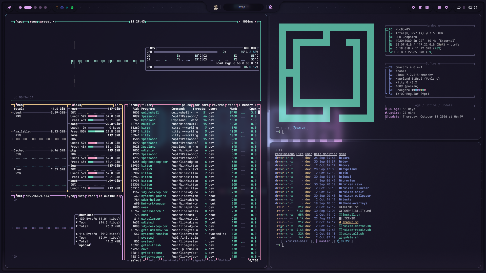</a></td>
<td align="center" width="33%"><a href="preview/preview_1.png">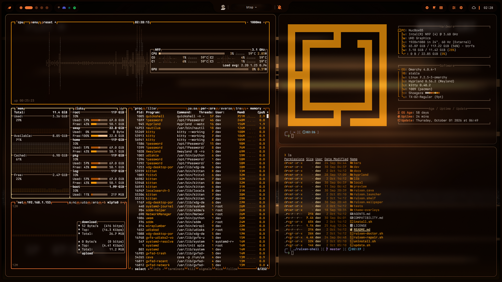</a></td>
<td align="center" width="33%"><a href="preview/preview_2.png">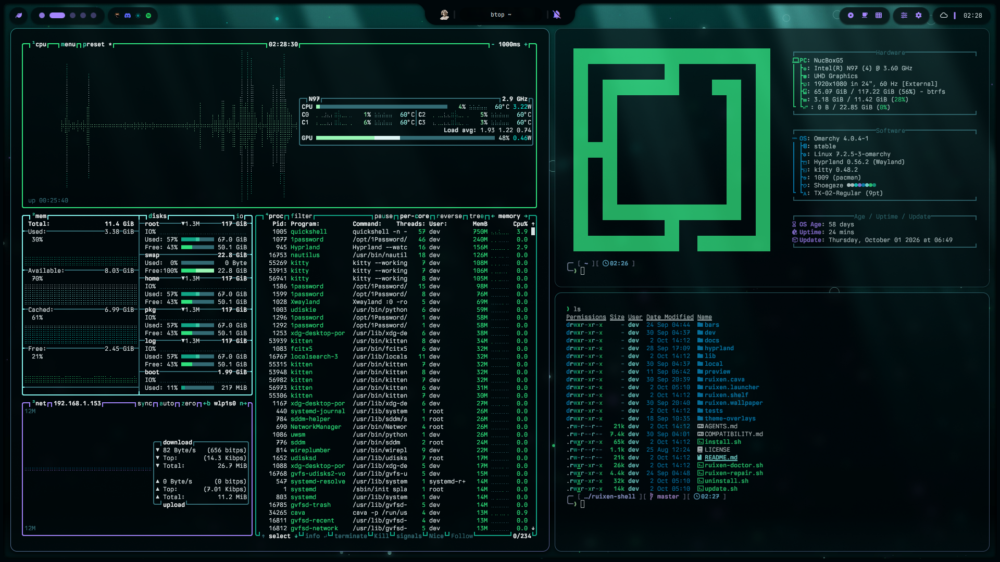</a></td>
</tr>
</table>

<p align="center"><sub>One desktop, three themes: the bar, notch and frame follow whichever Omarchy theme you pick.</sub></p>

## What is Ruixen?

Ruixen runs as plugins inside the Omarchy shell you already use. A bar, a
notch dashboard, a launcher, a settings app and a handful of small tools
share one look and one set of behaviors, so they feel like a single desktop
instead of a pile of widgets.

It is **not** a replacement shell, **not** just a theme, and **not** a
random plugin pack. Turn any piece off, or go back to stock Omarchy in one
command.

## The experience

### A connected bar and notch

A bar of floating glass pills (or one docked strip flush with the frame)
wraps the screen in an OLED-black frame. In the middle, the notch expands
into a dashboard: music, calendar, notifications, quick toggles, volume,
wallpapers with a theme switcher, system health, and a Kanban board.

<table>
<tr>
<td align="center" width="33%">
<a href="preview/preview_float.png">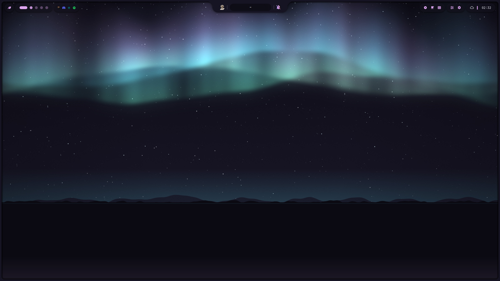</a>
<br><sub><b>Floating bar</b></sub>
</td>
<td align="center" width="33%">
<a href="preview/preview_dock.png">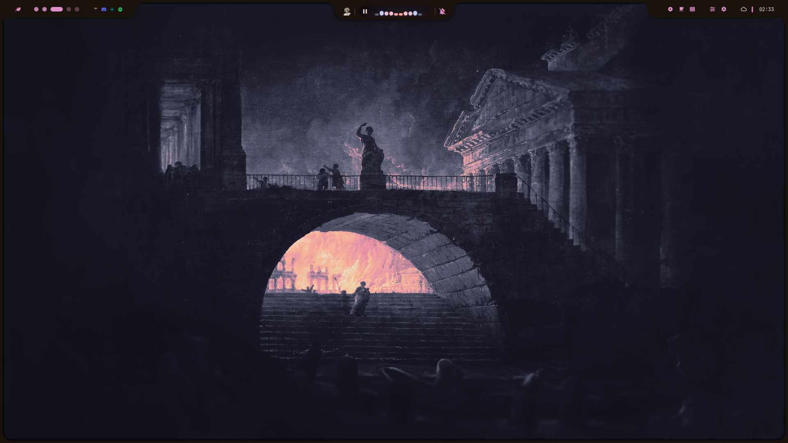</a>
<br><sub><b>Docked bar</b></sub>
</td>
<td align="center" width="33%">
<a href="preview/preview_notch.png">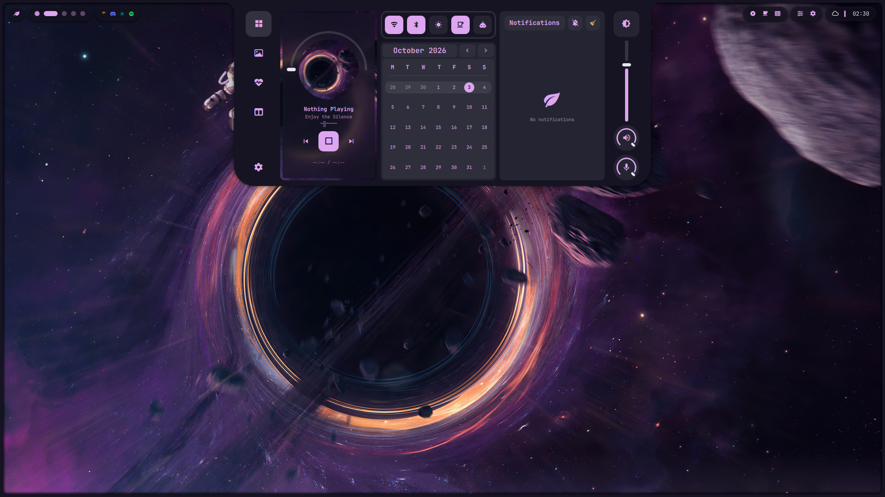</a>
<br><sub><b>Notch dashboard</b></sub>
</td>
</tr>
</table>

The notch also holds a three-column **Kanban board** that you and your coding
agent can both drive from a keybind or a script.

<p align="center">
<a href="preview/preview_kanban.png">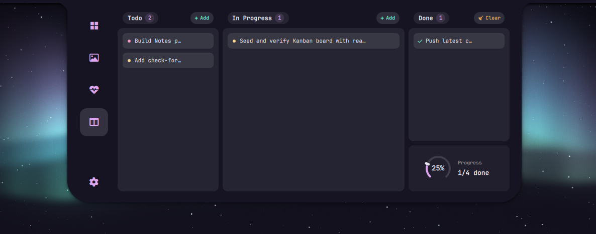</a>
</p>

### One launcher for apps, commands, files and clipboard

A Raycast/Spotlight-style palette on real compositor blur. Search Omarchy
actions and installed apps, search files by name **and** contents across
every drive with live previews, browse Clipboard History, and browse, preview and
install community themes from the bjarneo collection.

<table>
<tr>
<td align="center" width="50%">
<a href="preview/preview_launcher_files.png">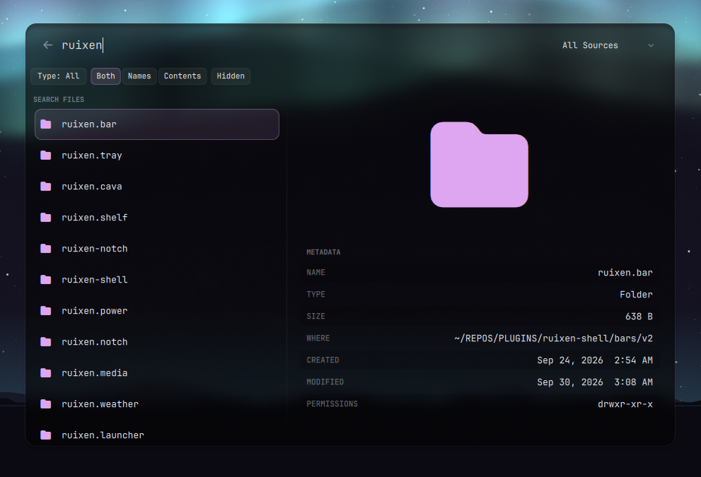</a>
<br><sub><b>Search Files</b>: names and contents, with previews</sub>
</td>
<td align="center" width="50%">
<a href="preview/preview_clipboard.png">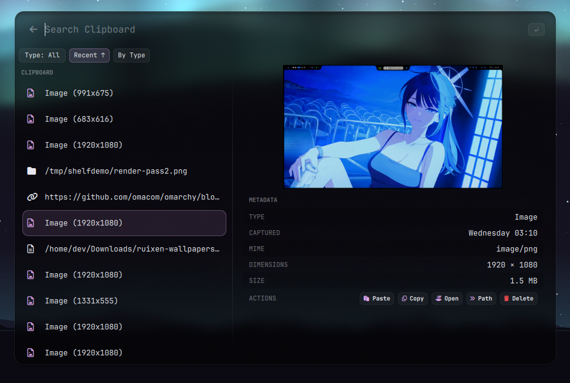</a>
<br><sub><b>Clipboard History</b></sub>
</td>
</tr>
<tr>
<td align="center" width="50%">
<a href="preview/preview_themes.png">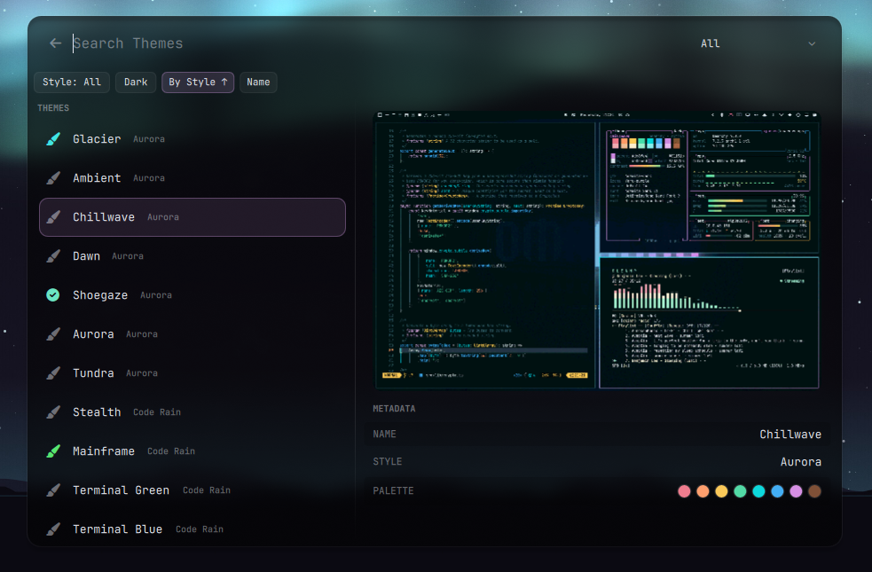</a>
<br><sub><b>Theme browser</b></sub>
</td>
<td align="center" width="50%">
<a href="preview/preview_launcher.png">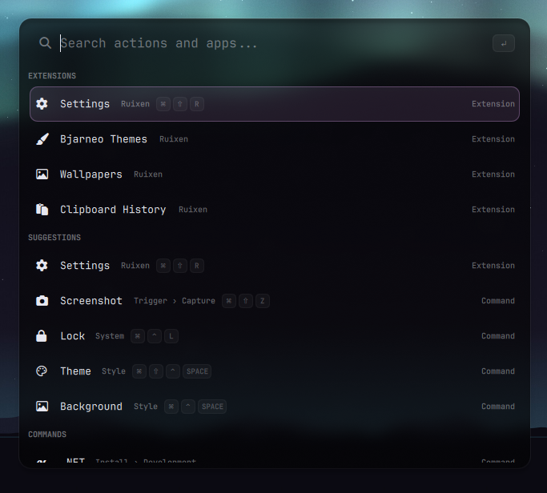</a>
<br><sub><b>The palette</b>: actions, apps and extensions</sub>
</td>
</tr>
</table>

### Settings that live in the same place

Profile, bar layout, window look, audio, Wi-Fi, Bluetooth, display, night
light and plugins, in the same overlay as the launcher.

<p align="center">
<a href="preview/preview_settings.png">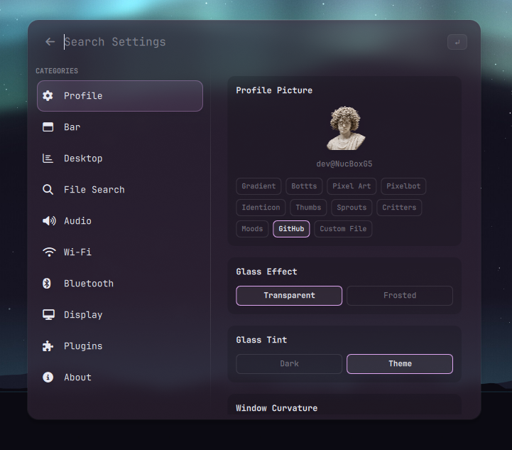</a>
</p>

### A drop pocket for files

Drag files in from any app, drag them back out into another app or a
terminal. The **Shelf** grows out of the frame at the notch, only remembers
paths (it never copies or moves anything), and is readable and writable by
your coding agent.

### And more

- **Kanban** in the notch: a three-column board you and an agent can both drive.
- **Wallpapers**, including muted looping video, and an audio visualizer.
- **Plugin pinning**: install any Omarchy bar widget, pin it from the bar, no config editing.
- **Peripherals**: battery levels for wireless mice, keyboards, headsets and controllers.
- **Window look**: rounded corners and blur to match the frame, or stock square.

Everything is controllable from a keybind, a script or an agent through
`omarchy-shell`: see [Control](docs/CONTROL.md).

## Quick install

```bash
git clone https://github.com/gitcoder89431/ruixen-shell.git
cd ruixen-shell
./install.sh
```

Want to see what it will do first? `./install.sh --dry-run` changes nothing.
The installer backs up what it replaces, merges into your existing
`shell.json` instead of overwriting it, and restarts the Omarchy shell.
Details, updating and uninstalling: [Installation](docs/INSTALLATION.md).

## Getting started

Nothing opens the launcher out of the box, because the installer doesn't
touch your Hyprland config unless you ask. To install the recommended keys
that are still free:

```bash
./install.sh --with-launcher-keybind
```

| Key | Opens |
|---|---|
| `SUPER+R` | Ruixen Launcher |
| `SUPER+SHIFT+R` | Ruixen Settings |
| `SUPER+CTRL+SPACE` | Wallpapers picker |
| `SUPER+D` | Shelf |

Or bind your own: see [Keybinds](docs/KEYBINDS.md). Then take the
[manual](docs/README.md) for a tour.

## Documentation

| I want to... | Go to |
|---|---|
| Find my way around | [Manual index](docs/README.md) |
| Install, update, repair or uninstall | [Installation](docs/INSTALLATION.md) |
| Search files, use the clipboard | [Launcher](docs/LAUNCHER.md) |
| Set up keybinds | [Keybinds](docs/KEYBINDS.md) |
| Change the bar or window look | [Customizing](docs/CUSTOMIZATION.md) |
| See what each plugin does | [Plugins and features](docs/PLUGINS.md) |
| Script it or hand it to an agent | [Control](docs/CONTROL.md) |
| Check version support | [`COMPATIBILITY.md`](COMPATIBILITY.md) |
| Build or contribute | [`dev/`](dev/README.md) |
| Rules for coding agents | [`AGENTS.md`](AGENTS.md) |

## Requirements

Omarchy `4.0.0-1` or a nearby build of the same shell generation (live-verified
through `4.0.4-1`), Quickshell as provided by Omarchy, and `jq`. A few optional
tools unlock specific features (video wallpapers, the audio visualizer,
weather); the installer warns about any that are missing. Full list:
[Installation](docs/INSTALLATION.md#requirements).

## Credits

- **[Omarchy](https://omarchy.org)** ([github.com/basecamp/omarchy](https://github.com/basecamp/omarchy)) — the Arch/Hyprland desktop this whole project is built on top of. `omarchy-shell`, Omarchy's own Quickshell-based bar/notch/notification runtime, is what every plugin here actually loads into.
- **[Ambxst](https://github.com/Axenide/Ambxst)** (by Axenide) — UI/UX design inspiration for several `ruixen.notch` panels (the dashboard layout, calendar, metrics page, wallpapers picker). Ambxst's own code is AGPL-3.0 licensed; ruixen-shell's implementations are written independently, not derived from its source.
- **[xgborgeso/omarchy-peripheral-batteries](https://github.com/xgborgeso/omarchy-peripheral-batteries)** (MIT) — `ruixen.peripherals`'s detection logic is ported from this project (see [Plugins](docs/PLUGINS.md), and the plugin's own source header for the full attribution).

## License

Released under the [MIT License](LICENSE).
